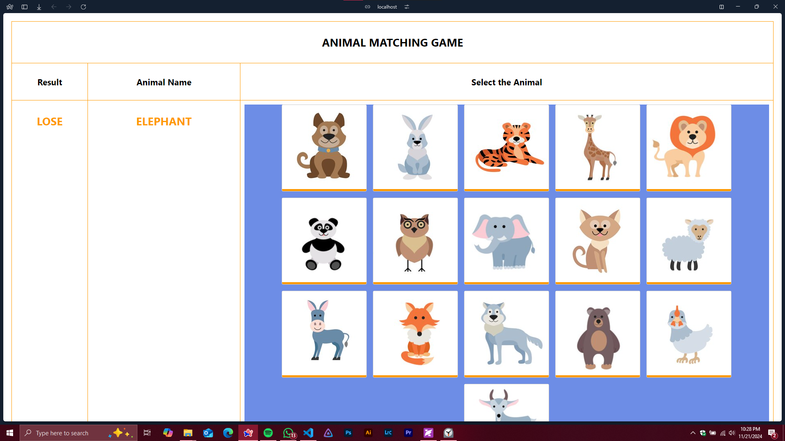

# Animal Matching Game (Assignment-04)
A fun and interactive game designed to enhance children's object recognition and language skills. Players match the displayed animal name with the correct image from a grid of 16 animals. Immediate feedback encourages learning: Win for correct matches and Lose for incorrect ones. 

---

## Features 

- **Random Animal Selection**: Displays a randomly chosen animal name at the start of each round.
- **Interactive Gameplay**: Players click on an image to match it with the displayed name.
- **Feedback System**: Displays "WIN" or "LOSE" based on the player's choice.
- **Automatic Refresh**: The game automatically resets for the next round after a brief delay.
- **Dynamic Image Grid**: Displays all animal images dynamically from the database.

---

## 🚀 Technology Stack 

- **React**: For building the user interface.
- **JavaScript**: Core logic for randomization and interactivity.
- **CSS**: Styling for the application layout and visuals.

---

## 🚦 Getting Started
### Prerequisites

Before you begin, ensure you have the following installed on your system:

- **Node.js** (v14 or higher)
- **npm** (Node Package Manager)

1. **Clone the Repository**:
   ```bash
   git clone https://github.com/IT3133-Project/Assignment-04.git
   cd assignment04
    ```

2. **Install Dependencies:**
    ```bash
   npm install
    ```

3. **Start the Server**
    ```bash
   npm start
    ```
4. **Access the App**
- Open your browser and navigate to http://localhost:3000

---

## How to Play
1. A random animal name is displayed at the top of the screen.
2. Select the corresponding image from the 4x4 grid of animal images.
3. Feedback:
    - If correct, "WIN" is displayed.
    - If incorrect, "LOSE" is displayed.
4. The game automatically resets for the next round after displaying the feedback.

---

# Screenshots
### Winning Screen


### Losing Screen


---

